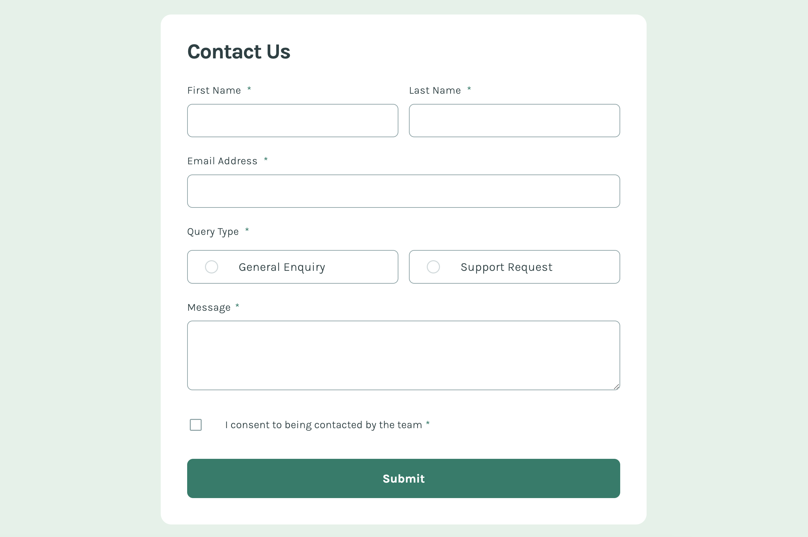

# Frontend Mentor - Contact form solution

This is a solution to the [Contact form challenge on Frontend Mentor](https://www.frontendmentor.io/challenges/contact-form--G-hYlqKJj). Frontend Mentor challenges help you improve your coding skills by building realistic projects.

## Table of contents

- [The challenge](#the-challenge)
- [Screenshot](#screenshot)
- [Links](#links)
- [Built with](#built-with)
- [What I learned](#what-i-learned)

### Screenshot

### Links

- Solution URL: [https://github.com/tunaerten/contact-form]
- Live Site URL: [https://contact-form-erten.netlify.app/]

## My process

### Built with

- Semantic HTML5 markup
- CSS custom properties
- Flexbox
- CSS Grid
- Mobile-first workflow
- JavaScript

### What I learned

I struggled quite a bit with styling radio buttons and checkboxes, but after some research, I think I’ve figured it out. Other than that, I didn’t face many challenges. I realize now that I should plan and write the error messages in the initial HTML structure next time. Since I didn’t do that, I had to rewrite the code from scratch. Nevertheless, it was an enjoyable project. I’d appreciate any advice you can offer!
